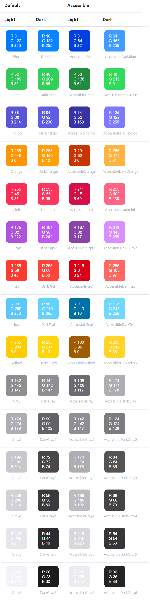

# js-shared

This is a general utility class and function package.

## Installation

```sh
npm install js-shared;
```

## Usage

### Detect browser.

```js
import { Browser } from "js-shared";

Browser.parse(navigator.userAgent);
  // {
  //   platform: 'mobile',
  //   osName: 'Android',
  //   osVersion: 9,
  //   browserName: 'Chrome'
  // }
```

### Collection utility.

Import.

```js
import { Collection } from "js-shared";
```

Remove duplicates from an array

```js
Collection.unique(['green', 'red','green', 'blue', 'red']);
  // [
  //   "green",
  //   "red",
  //   "blue"
  // ]
  // [ "green", "red", "blue" ]
```

### System color.

The following color values ​​are various colors that adapt to changing accessibility settings.



Import.

```js
import { Color } from "js-shared";
```

How to use colors.

```js
Color.blue;// rgb(0,122,255)
Color.darkBlue;// rgb(10,132,255)
Color.accessibleBlue;// rgb(0,64,221)
Color.accessibleDarkBlue;// rgb(64,156,255)
```

### Date utility.

Import.

```js
import { Date } from "js-shared";
```

Format current date

```js
Date.format();// 2020-03-20T12:17:34+09:00
Date.format('dddd, MMMM Do YYYY, h:mm:ss a');// Friday, March 20th 2020, 12:17:34 pm
Date.format('ddd, hA');// Fri, 12PM
Date.format('2020-01-01');// 2020-01-01T00:00:00+09:00
Date.format('2020-01-01', 'dddd, MMMM Do YYYY, h:mm:ss a');// Wednesday, January 1st 2020, 12:00:00 am
Date.format('2020-01-01', 'ddd, hA');// Wed, 12AM
```

Returns an array of times

```js
Date.timesOneDay();// ["00:00", "01:00", "02:00", "03:00", "04:00", "05:00", "06:00", "07:00", "08:00", "09:00", "10:00", "11:00", "12:00", "13:00", "14:00", "15:00", "16:00", "17:00", "18:00", "19:00", "20:00", "21:00", "22:00", "23:00", "00:00"]
Date.timesOneDay(9);// ["09:00", "10:00", "11:00", "12:00", "13:00", "14:00", "15:00", "16:00", "17:00", "18:00", "19:00", "20:00", "21:00", "22:00", "23:00", "00:00", "01:00", "02:00", "03:00", "04:00", "05:00", "06:00", "07:00", "08:00", "09:00"]
Date.timesOneDay('LT');// ["12:00 AM", "1:00 AM", "2:00 AM", "3:00 AM", "4:00 AM", "5:00 AM", "6:00 AM", "7:00 AM", "8:00 AM", "9:00 AM", "10:00 AM", "11:00 AM", "12:00 PM", "1:00 PM", "2:00 PM", "3:00 PM", "4:00 PM", "5:00 PM", "6:00 PM", "7:00 PM", "8:00 PM", "9:00 PM", "10:00 PM", "11:00 PM", "12:00 AM"]
Date.timesOneDay(9, 'LT');// ["9:00 AM", "10:00 AM", "11:00 AM", "12:00 PM", "1:00 PM", "2:00 PM", "3:00 PM", "4:00 PM", "5:00 PM", "6:00 PM", "7:00 PM", "8:00 PM", "9:00 PM", "10:00 PM", "11:00 PM", "12:00 AM", "1:00 AM", "2:00 AM", "3:00 AM", "4:00 AM", "5:00 AM", "6:00 AM", "7:00 AM", "8:00 AM", "9:00 AM"]
```

Returns consecutive dates at regular intervals

```js
Date.daysInMonth();// ["1", "2", "3", "4", "5", "6", "7", "8", "9", "10", "11", "12", "13", "14", "15", "16", "17", "18", "19", "20", "21", "22", "23", "24", "25", "26", "27", "28", "29", "30", "31"]
Date.daysInMonth('MMM D');// ["Jul 1", "Jul 2", "Jul 3", "Jul 4", "Jul 5", "Jul 6", "Jul 7", "Jul 8", "Jul 9", "Jul 10", "Jul 11", "Jul 12", "Jul 13", "Jul 14", "Jul 15", "Jul 16", "Jul 17", "Jul 18", "Jul 19", "Jul 20", "Jul 21", "Jul 22", "Jul 23", "Jul 24", "Jul 25", "Jul 26", "Jul 27", "Jul 28", "Jul 29", "Jul 30", "Jul 31"]
Date.daysInMonth('2020-01');// ["1", "2", "3", "4", "5", "6", "7", "8", "9", "10", "11", "12", "13", "14", "15", "16", "17", "18", "19", "20", "21", "22", "23", "24", "25", "26", "27", "28", "29", "30", "31"]
Date.daysInMonth('2020-01', 'MMM D');// ["Jan 1", "Jan 2", "Jan 3", "Jan 4", "Jan 5", "Jan 6", "Jan 7", "Jan 8", "Jan 9", "Jan 10", "Jan 11", "Jan 12", "Jan 13", "Jan 14", "Jan 15", "Jan 16", "Jan 17", "Jan 18", "Jan 19", "Jan 20", "Jan 21", "Jan 22", "Jan 23", "Jan 24", "Jan 25", "Jan 26", "Jan 27", "Jan 28", "Jan 29", "Jan 30", "Jan 31"]
```

Returns consecutive dates at regular intervals

```js
Date.range(7, 'years', '2020', '2030', 'Y');// ["2020", "2027"]
Date.range(7, 'months', '2020/1', '2030/1', 'M/Y');// ["1/2020", "8/2020", "3/2021", "10/2021", "5/2022", "12/2022", "7/2023", "2/2024", "9/2024", "4/2025", "11/2025", "6/2026", "1/2027", "8/2027", "3/2028", "10/2028", "5/2029", "12/2029"]
Date.range(1, 'weeks', '3/1', '3/31', 'ddd, M/D');// ["Thu, 3/1", "Thu, 3/8", "Thu, 3/15", "Thu, 3/22", "Thu, 3/29"]
Date.range(7, 'days', '3/1', '3/31', 'M/D');// ["3/1", "3/8", "3/15", "3/22", "3/29"]
Date.range(7, 'hours', '3/1, 0:00', '3/2, 0:00', 'H:mm');// ["0:00", "7:00", "14:00", "21:00"]
Date.range(30, 'minutes', '3/1, 9:00', '3/1, 12:00', 'H:mm');// ["9:00", "9:30", "10:00", "10:30", "11:00", "11:30", "12:00"]
Date.range(30, 'seconds', '3/1, 9:00', '3/1, 9:03', 'H:mm:ss');// ["9:00:00", "9:00:30", "9:01:00", "9:01:30", "9:02:00", "9:02:30", "9:03:00"]
```

Date addition

```js
Date.add('2020/3/21', 1, 'years', 'M/D/Y');// 3/21/2021
Date.add('2020/3/21', 1, 'months', 'M/D/Y');// 4/21/2020
Date.add('2020/3/21', 1, 'weeks', 'M/D/Y');// 3/28/2020
Date.add('2020/3/21', 1, 'days', 'M/D/Y');// 3/22/2020
Date.add('2020/3/21, 9:00:00', 1, 'hours', 'M/D/Y, H:mm:ss');// 3/21/2020, 10:00:00
Date.add('2020/3/21, 9:00:00', 1, 'minutes', 'M/D/Y, H:mm:ss');// 3/21/2020, 9:01:00
Date.add('2020/3/21, 9:00:00', 1, 'seconds', 'M/D/Y, H:mm:ss');// 3/21/2020, 9:00:01
```

Date validation

```js
Date.isValid('2012-05-25', 'YYYY-MM-DD', true); // true
Date.isValid('2012.05.25', 'YYYY-MM-DD', true); // false
Date.isValid('not a real date'); // false
Date.isValid('2010 13', 'YYYY MM'); // false (not a real month)
Date.isValid('2010 11 31', 'YYYY MM DD'); // false (not a real day)
Date.isValid('2010 2 29', 'YYYY MM DD'); // false (not a leap year)
Date.isValid('2010 notamonth 29', 'YYYY MMM DD'); // false (not a real month name)
```

### Graphic utility.
This will be explained later

### Miscellaneous utility.

Import.

```js
import { Misc } from "js-shared";
```

Returns false if the operating environment is a browser and true if it is Node.js

```js
Misc.isNodeEnvironment();// false
```

Returns a window object for browsers and a global object for Node.js

```js
Misc.getGlobal();
```

### Random utility.

Import.

```js
import { Random } from "js-shared";
```

Returns a number from 3 to 9

```js
Random.randInt(3, 9);
```

Get 1 element randomly from 3 elements

```js
Random.sample(['apple', 'banana', 'cherry']);
```

Basic pure ROYGBIV colors (sometimes)

```js
Random.randHSL({ smin: 80, smax: 100, lmin: 45, lmax: 55 });
```

Very dark colors (Rare)

```js
Random.randHSL({ smin: 70, smax: 100, lmin: 5, lmax: 40 });
```

Light dreamy pastels (very frequent)

```js
Random.randHSL({ smin: 10, smax: 100, lmin: 50, lmax: 95 });
```

### Template engine.

A template language that can generate HTML markup with JS.

Import.

```js
import { Template } from "js-shared";
```

Basic Usage

```JS
Template.compile(`
  <p>Hello, my name is {{name}}.I am from {{hometown}}.I have {{kids.length}} kids:</p>
  <ul>
    {{#kids}}
      <li>{{name}} is {{age}}</li>
    {{/kids}}
  </ul>`)({
    name: 'Alan',
    hometown: 'Texas',
    kids: [
      { name: 'Jimmy', age: '12' },
      { name: 'Sally', age: '4' }
    ]
  });
  // <p>Hello, my name is Alan.I am from Texas.I have 2 kids:</p>
  // <ul>
  //   <li>Jimmy is 12</li>
  //   <li>Sally is 4</li>
  // </ul>
```

if

```js
Template.compile(`
  {{#if author}}
    <h1>{{firstName}} {{lastName}}</h1>
  {{else}}
    <h1>Unknown Author</h1>
  {{/if}}`)({
    author: true,
    firstName: 'Yehuda',
    lastName: 'Katz'
  });
  // <h1>Yehuda Katz</h1>
```

HTML-escaping

```js
Template.compile(`
    raw: {{{specialChars}}}
    html-escaped: {{specialChars}}`
  )({
    specialChars: "& < > \" ' ` ="
  });
  // raw: & < > " ' ` =
  // html-escaped: &amp; &lt; &gt; &quot; &#x27; &#x60; &#x3D;
```

each

```js
Template.compile(`
  <ul>
    {{#each people}}
      <li>{{this}}</li>
    {{/each}}
  </ul>`)({
    people: [ 'Yehuda Katz', 'Alan Johnson', 'Charles Jolley' ]
  });
  // <ul class="people_list">
  //   <li>Yehuda Katz</li>
  //   <li>Alan Johnson</li>
  //   <li>Charles Jolley</li>
  // </ul>
Template.compile(`
  <ul>
    {{#each persons}}
      <li>{{name}} ({{country}})</li>
    {{/each}}
  </ul>`)({
    persons: [
      { name: 'Nils', country: 'Germany' },
      { name: 'Yehuda', country: 'USA' }
    ]
  });
  // <ul>
  //   <li>Nils (Germany)</li>
  //   <li>Yehuda (USA)</li>
  // </ul>
```

Round number.

```js
Template.compile('{{value}} round to {{round value}}')({ value: 1.4 });// 1.4 round to 1
Template.compile('{{value}} round to {{round value}}')({ value: 1.5 });// 1.5 round to 2
Template.compile('{{value}} round to {{round value}}')({ value: 1.6 });// 1.6 round to 2
Template.compile('{{value}} round to {{round 2 value}}')({ value: 1.016 });// 1.016 round to 1.02
Template.compile('{{value}} round to {{round 2 value}}')({ value: 1.015 });// 1.015 round to 1.02
Template.compile('{{value}} round to {{round 2 value}}')({ value: 1.014 });// 1.014 round to 1.01
Template.compile('{{value}} ceil to {{ceil value}}')({ value: 1.4 });// 1.4 ceil to 2
Template.compile('{{value}} ceil to {{ceil value}}')({ value: 1.5 });// 1.5 ceil to 2
Template.compile('{{value}} ceil to {{ceil value}}')({ value: 1.6 });// 1.6 ceil to 2
Template.compile('{{value}} ceil to {{ceil 2 value}}')({ value: 1.016 });// 1.016 ceil to 1.02
Template.compile('{{value}} ceil to {{ceil 2 value}}')({ value: 1.015 });// 1.015 ceil to 1.02
Template.compile('{{value}} ceil to {{ceil 2 value}}')({ value: 1.014 });// 1.014 ceil to 1.02
Template.compile('{{value}} floor to {{floor value}}')({ value: 1.4 });// 1.4 floor to 1
Template.compile('{{value}} floor to {{floor value}}')({ value: 1.5 });// 1.5 floor to 1
Template.compile('{{value}} floor to {{floor value}}')({ value: 1.6 });// 1.6 floor to 1
Template.compile('{{value}} floor to {{floor 2 value}}')({ value: 1.016 });// 1.016 floor to 1.01
Template.compile('{{value}} floor to {{floor 2 value}}')({ value: 1.015 });// 1.015 floor to 1.01
Template.compile('{{value}} floor to {{floor 2 value}}')({ value: 1.014 });// 1.014 floor to 1.01
```

Operator.

```js
// Equal to
Template.compile('{{#if (eq value1 value2)}}true{{else}}false{{/if}}')({ value1: 3, value2: 3 });// true

// Not equal to
Template.compile('{{#if (ne value1 value2)}}true{{else}}false{{/if}}')({ value1: 3, value2: 3 });// false

// Less than
Template.compile('{{#if (lt value1 value2)}}true{{else}}false{{/if}}')({ value1: 3, value2: 4 });// true

// Greater than
Template.compile('{{#if (gt value1 value2)}}true{{else}}false{{/if}}')({ value1: 3, value2: 4 });// false

// Less than or equal to
Template.compile('{{#if (le value1 value2)}}true{{else}}false{{/if}}')({ value1: 3, value2: 4 });// true

// Greater than or equal to
Template.compile('{{#if (ge value1 value2)}}true{{else}}false{{/if}}')({ value1: 3, value2: 4 });// false

// And operator
Template.compile('{{#if (and value1 value2)}}true{{else}}false{{/if}}')({ value1: true, value2: true });// true
Template.compile('{{#if (and value1 value2)}}true{{else}}false{{/if}}')({ value1: true, value2: false });// false
Template.compile('{{#if (and value1 value2)}}true{{else}}false{{/if}}')({ value1: false, value2: false });// false

// Or operator
Template.compile('{{#if (or value1 value2)}}true{{else}}false{{/if}}')({ value1: true, value2: true });// true
Template.compile('{{#if (or value1 value2)}}true{{else}}false{{/if}}')({ value1: true, value2: false });// true
Template.compile('{{#if (or value1 value2)}}true{{else}}false{{/if}}')({ value1: false, value2: false });// false
```

Use Moment in a template

Current date.

```js
Template.compile('{{moment}}')();// 2020-07-20T03:34:29+09:00
```

Specific date.

```js
Template.compile('{{moment d}}')({ d: '7/21/2020' });// 2020-07-21T00:00:00+09:00
Template.compile('{{moment date=d}}')({ d: '7/21/2020' });// 2020-07-21T00:00:00+09:00
```

Date format.

```js
Template.compile('{{moment d "YY, MMM dd"}}')({ d: '7/21/2020' });// 20, Jul Tu
Template.compile('{{moment date=d format="DD/MM/YYYY"}}')({ d: '7/21/2020' });// 21/07/2020
Template.compile('{{moment d unix=true}}')({ d: '7/21/2020' });// 2020-07-21T00:00:00+09:00
```

Date input parsing.

```js
Template.compile('{{moment d input="DD/YYYY/MM"}}')({ d: '21/2020/07' });// 2020-07-21T00:00:00+09:00
Template.compile('{{moment d input="DD/YYYY/MM"}}')({ d: '7/21//2020' });// Invalid date
```

Date timezone.

```js
Template.compile('{{moment d utc=true}}')({ d: '7/21/2020' });// 2020-07-21T00:00:00Z
Template.compile('{{moment d local=true}}')({ d: '7/21/2020' });// 2020-07-20T04:00:49+09:00Z
```

Date units.

```js
Template.compile('{{moment d "millisecond"}}')({ d: '7/21/2020 03:30:26.123' });// 123
Template.compile('{{moment d "second"}}')({ d: '7/21/2020 03:30:26.123' });// 26
Template.compile('{{moment d "minute"}}')({ d: '7/21/2020 03:30:26.123' });// 30
Template.compile('{{moment d "hour"}}')({ d: '7/21/2020 03:30:26.123' });// 3
Template.compile('{{moment d "date"}}')({ d: '7/21/2020 03:30:26.123' });// 21
Template.compile('{{moment d "day"}}')({ d: '7/21/2020 03:30:26.123' });// 2
Template.compile('{{moment d "weekday"}}')({ d: '7/21/2020 03:30:26.123' });// Tuesday
Template.compile('{{moment d "weekday" type="s"}}')({ d: '7/21/2020 03:30:26.123' });// Tue
Template.compile('{{moment d "weekday" type="xs"}}')({ d: '7/21/2020 03:30:26.123' });// Tu
Template.compile('{{moment d "weekday" type="number"}}')({ d: '7/21/2020 03:30:26.123' });// 2
Template.compile('{{moment d "isoweekday"}}')({ d: '7/21/2020 03:30:26.123' });// 2
Template.compile('{{moment d "dayofyear"}}')({ d: '7/21/2020 03:30:26.123' });// 203
Template.compile('{{moment d "week"}}')({ d: '7/21/2020 03:30:26.123' });// 30
Template.compile('{{moment d "isoweek"}}')({ d: '7/21/2020 03:30:26.123' });// 30
Template.compile('{{moment d "month"}}')({ d: '7/21/2020 03:30:26.123' });// 6
Template.compile('{{moment d "year"}}')({ d: '7/21/2020 03:30:26.123' });// 2020
Template.compile('{{moment d "weekyear"}}')({ d: '7/21/2020 03:30:26.123' });// 2020
Template.compile('{{moment d "isoweekyear"}}')({ d: '7/21/2020 03:30:26.123' });// 2020
```

Date manipulation.

```js
Template.compile('{{moment d add="days" amount="7"}}')({ d: '7/21/2020' });// 2020-07-28T00:00:00+09:00
Template.compile('{{moment d add="365" addparam="d"}}')({ d: '7/21/2020' });// 2021-07-21T00:00:00+09:00
Template.compile('{{moment d subtract="days" amount="7"}}')({ d: '7/21/2020' });// 2020-07-14T00:00:00+09:00
Template.compile('{{moment d subtract="365" subtractparam="d"}}')({ d: '7/21/2020' });// 2019-07-22T00:00:00+09:00
```

Start and end of years.

```js
Template.compile('{{moment d startof="year"}}')({ d: '7/21/2020' });// 2020-01-01T00:00:00+09:00
Template.compile('{{moment d endof="year"}}')({ d: '7/21/2020' });// 2020-12-31T23:59:59+09:00
```

Date from now and specific dates.  
If the current date and time is 2:00 am, July 20, 2020.

```js
Template.compile('{{moment d "fromNow"}}')({ d: '7/20/2020' });// 4 hours ago
Template.compile('{{moment d "fromNow"}}')({ d: '7/21/2020' });// in 19 hours
Template.compile('{{moment d "from" dfrom}}')({ d: '7/21/2020 03:00:00', dfrom: '7/21/2020 07:00:00' });// 4 hours ago
```

Date as calendar time

```js
Template.compile('{{moment d "calendar"}}')({ d: '7/21/2020' });// Tomorrow at 12:00 AM
```

Moment utils

```js
Template.compile('{{moment d "daysinmonth"}}')({ d: '7/21/2020' });// 31
Template.compile('{{moment d "todate"}}')({ d: '7/21/2020' });// Tue Jul 21 2020 00:00:00 GMT+0900 (日本標準時)
Template.compile('{{moment d "array"}}')({ d: '7/21/2020' });// 2020,6,21,0,0,0,0
Template.compile('{{moment d "isostring"}}')({ d: '7/21/2020' });// 2020-07-20T15:00:00.000Z
```

### Type utility.

Utility for type determination and type related processing.

Import.

```js
import { Types } from "js-shared";
```

Returns whether it is an Async function

```js
function async myAsyncFunction {}
function myFunction() {}

Types.isAsync(myFunction);// false
Types.isAsync(myAsyncFunction);// true
```
